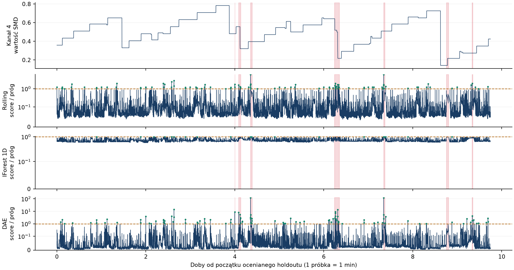

# Telemetry Benchmark | TB-01

Lokalne rozpoznanie metod detekcji anomalii: monitoring progowy, niezależne Isolation Forest dla kanałów oraz wielowymiarowy autoenkoder odszumiający PyTorch. Jeden zbiór SMD i jedna maszyna, machine-1-2. Zakres obejmuje implementację metod, kalibrację, walidację, zamrożony test i analizę incydentów.

## Wynik referencyjny

| Metoda | Precision | Recall | F1 | FA / dobę |
|---|---:|---:|---:|---:|
| Średnia ruchoma | 0.095 | 0.857 | 0.171 | 5.64 |
| Isolation Forest 1D | 0.118 | 0.286 | 0.167 | 1.54 |
| Autoenkoder DAE | 0.095 | 0.857 | 0.171 | 5.54 |

Holdout: 14 037 próbek, 7 incydentów. Baseline wybrany na walidacji: Isolation Forest 1D.
Autoenkoder nie wykazał przewagi F1 nad średnią ruchomą. Wyniki wszystkich trzech metod są raportowane; głównego porównania z baseline'em wybranym na walidacji nie zmieniamy po odczycie testu.

[Raport techniczny PDF](reports/RAPORT.pdf) · [Protokół](PROTOCOL.md) · [Pełny pakiet referencyjny v0.1.0 z danymi i modelem](https://github.com/cleanerzkp/telemetry-benchmark/releases/tag/v0.1.0)



### Jak czytać te liczby

Metryki dotyczą incydentów i epizodów alarmowych zgodnie z [protokołem](PROTOCOL.md), a nie trafności klasyfikacji pojedynczych próbek. Autoenkoder wygenerował **63 epizody alarmowe: 6 dopasowanych do różnych incydentów, 54 fałszywe oraz 3 duplikaty**. Precision = 6/63 = 9,52%. Duplikaty obniżają precision, ale nie są wliczane do osobno raportowanego FA/dobę. Dlatego 1 − precision nie jest tutaj dokładnie udziałem fałszywych alarmów. Surowe liczności są w [results/metrics.json](results/metrics.json), a dopasowania w [results/alerts.csv](results/alerts.csv).

**Siedem incydentów to mała próba.** Recall przyjmuje tylko wartości 0/7, 1/7, …, 7/7; jedno dodatkowe wykrycie zmienia go o około 14,3 punktu procentowego. Identyczny recall 0,857 dla średniej ruchomej i autoenkodera oznacza w obu przypadkach 6/7 wykryć. Identyczne precision i F1 wynikają także z tej samej liczby epizodów i dopasowań, nie dowodzą identycznych predykcji. Wynik z jednej maszyny i jednego seeda nie wystarcza do uogólniania skuteczności.

## Artefakty

- `PROTOCOL.md`: metodyka ustalona przed treningiem, w tym procedura wyznaczania progów.
- `config.json`: pojedyncza konfiguracja, bez strojenia.
- `data/manifest.json`: wersja źródła, indeksy podziału i SHA-256.
- `results/freeze.json`: wytrenowany model, wartości progów po kalibracji i baseline wybrany na walidacji; zamrożenie przed testem końcowym.
- `results/metrics.json`: wyniki trzech metod na końcowym holdoucie.
- `results/alerts.csv`, `results/incidents.csv`: audyt alarmów i dopasowań.
- `results/scores.npz`: zapis predykcji oraz błędów rekonstrukcji.
- `reports/RAPORT.pdf`: dwustronicowy raport techniczny.
- `reports/benchmark.png`: pełny przebieg testowy z detekcjami.

## Kolejność zamrożenia i testu

Przed treningiem ustalono podział danych, metryki, konfigurację oraz **procedurę wyznaczania progów**, nie ich wartości liczbowe. Progi wyznaczono następnie na wydzielonym bloku kalibracyjnym. Na zbiorze walidacyjnym wybrano baseline; model, progi i ten wybór zamrożono przed odczytem końcowego holdoutu.

Historia referencyjnego przebiegu zachowuje trzy osobne etapy:

| Etap | Commit | Zapis |
|---|---|---|
| Protokół i implementacja | [`befc8ed`](https://github.com/cleanerzkp/telemetry-benchmark/commit/befc8edff39c96b67c365b100f678bfb8635b2a9) | Protokół, konfiguracja, kod i manifest przed etapem `fit`. |
| Zamrożenie po uczeniu i kalibracji | [`cd2d192`](https://github.com/cleanerzkp/telemetry-benchmark/commit/cd2d192b74ada5d05ab66896933232163ce7b371) | `results/freeze.json` przed etapem `test`. |
| Wyniki końcowego testu | [`fac8cd2`](https://github.com/cleanerzkp/telemetry-benchmark/commit/fac8cd2f4a37997ab37585f9bda11743881c6e5b) | Metryki, audyt incydentów i raport. |

`fit` odmawia użycia istniejącego katalogu wyników, a `test` wymaga zapisanego w Git zamrożenia, sprawdza sumy kontrolne i tworzy `TEST_OPENED.json` przed odczytem wartości holdoutu. Zabezpieczenia ograniczają przypadkowe ponowienie testu i zmianę artefaktów w tej samej kopii roboczej. Historia Git jest zapisem kolejności i wersji, **nie niezależnym znacznikiem czasu ani dowodem, że publicznych danych nigdy wcześniej nie oglądano**.

## Środowisko i interfejs

Python 3.14; PyTorch, NumPy, scikit-learn. Referencyjny przebieg wykonano lokalnie na CPU, bez usług zewnętrznych. Dokładne wersje: `requirements-lock.txt`.

```sh
python -m pip install -r requirements-lock.txt
python -m unittest discover -s tests
python run.py prepare
# Protokół, konfiguracja, kod i manifest muszą być zapisane w Git przed fit.
python run.py fit
# results/freeze.json musi być zapisany w Git przed test.
python run.py test
python render_report.py
```

W dostarczonym pakiecie dane są przygotowane, a przebieg zakończony. Polecenia prepare/fit/test celowo odmawiają nadpisania istniejących artefaktów. Raport można ponownie renderować z zapisanych wyników. Ponowny eksperyment wymaga osobnej kopii roboczej, jawnego identyfikatora i nowej historii; ponowne użycie tych samych danych nie staje się niezależnym testem.

## Pochodzenie danych

Repozytorium: https://github.com/NetManAIOps/OmniAnomaly
Commit: `7fb0e0acf89ea49908896bcc9f9e80fcfff6baf4`.
Źródła: `ServerMachineDataset/train/machine-1-2.txt`, `test/machine-1-2.txt`, `test_label/machine-1-2.txt`.
Oryginalne bajty zapisano odpowiednio w `data/train.raw`, `data/evaluation.raw`, `data/labels.raw`. Licencja źródłowa: `data/SOURCE_LICENSE`.

Dane i model dołączono do pakietu lokalnego; nie są automatycznie dodawane do Git. Git zawiera manifest z hashami, kod, protokół i wyniki. Pełny pakiet ZIP z danymi i wytrenowanym modelem jest dostępny w sekcji Releases repozytorium GitHub. Sam klon Git zawiera kod, wyniki i raporty; do wykonania audit.py potrzebny jest także model z pakietu. Dane i model w wydaniu odpowiadają hashom w zamrożonych artefaktach.

## Granice interpretacji

SMD zapewnia 38 kanałów tej samej maszyny, a nie heterogeniczne źródła radiowe. Podział na ciągłe bloki chronologiczne nie jest podziałem na niezależne przebiegi testbedu. FA/dobę zakłada regularne próbkowanie minutowe wskazane w literaturze; pliki źródłowe nie zawierają timestampów.

Rozpoznanie wykonano w jednej ustalonej konfiguracji, bez przeszukiwania hiperparametrów ani selekcji seedów. Etykiety punktowe przekształcono w incydenty według reguł protokołu. Autoenkoder uczy wspólnej reprezentacji 38 kanałów, ale nie jest to fuzja logów, alarmów i metryk z różnych typów infrastruktury. Eksperyment nie obejmuje adaptacji few-shot między instalacjami, grafowego wskazywania przyczyn ani kalibracji niepewności diagnozy. **Kalibracja progu alarmowego nie jest kalibracją prawdopodobieństwa poprawności diagnozy.**

Uzyskany wynik jest punktem odniesienia dla tej konfiguracji i tego zbioru, nie oszacowaniem maksymalnych możliwości detekcji. Nie dowodzi również, że dodanie innych metod zapewni określony wzrost precision lub recall. Taką hipotezę trzeba sprawdzić w osobnym eksperymencie, z uprzednio ustalonym protokołem i danymi testowymi niewykorzystanymi do strojenia. Niska precyzja wskazuje na duży udział niedopasowanych lub powielonych alarmów i pozostaje jawnie raportowanym ograniczeniem tego przebiegu.

Materiał dokumentuje wykonany eksperyment ML i jego metodykę. Nie zawiera deklaracji dorobku zawodowego ani walidacji rozwiązania radiokomunikacyjnego.

Objaśnienia w README uzupełniono po analizie zapisanych wyników. Ta zmiana dokumentacyjna nie modyfikuje zamrożonego protokołu, kodu, modeli, progów ani wyników referencyjnego wydania v0.1.0.
